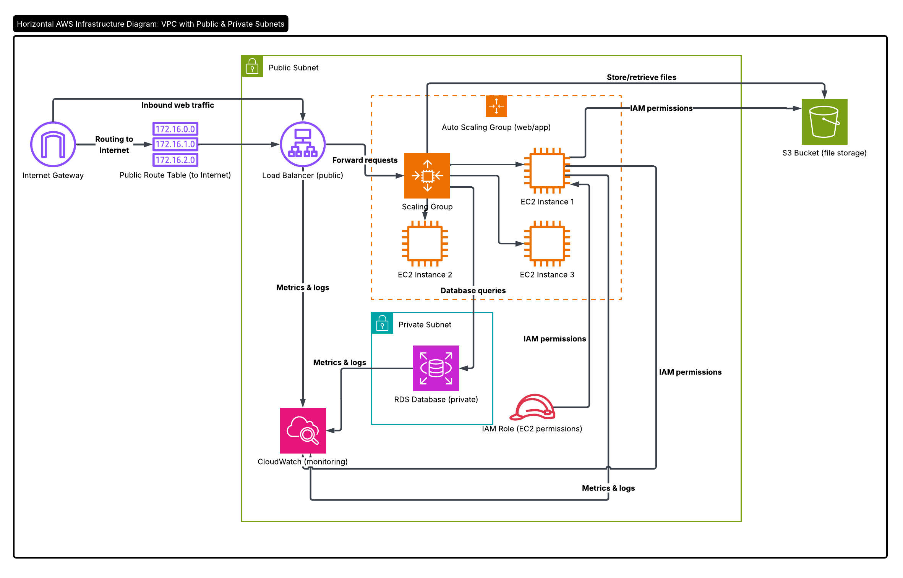

# Student Task Manager — AWS Infrastructure as Code

A full-stack web application for managing student tasks, deployed on AWS using strict Infrastructure as Code principles (Terraform). Students can create, read, update, and delete tasks and attach files that are stored in Amazon S3.

## Architecture Overview


### Traffic Flow
 
1. A student navigates to the ALB's public DNS name on port 80.
2. The ALB distributes the request to a healthy EC2 instance in a private subnet.
3. Nginx (on EC2) reverse-proxies to Gunicorn running the Flask app on port 5000.
4. The app reads/writes task data to RDS PostgreSQL (private subnet only).
5. File uploads are streamed directly to S3; pre-signed URLs are generated for downloads.
6. CloudWatch Agent on each EC2 ships logs and metrics to CloudWatch.
## Application Details

The frontend is modeled using high aesthetic standards featuring **Glassmorphism**, gradients, micro-animations, and dynamic visual interactions driven by standard CSS/HTML over a lightweight Python `Flask` API.

## Pre-Requisites

- Terraform 1.6+
- AWS CLI configured with proper IAM privileges

## AWS Services Used
 
| Service | Purpose |
|---|---|
| **VPC** | Isolated network with public and private subnets across 2 AZs |
| **Internet Gateway** | Outbound internet access for public subnets |
| **Load Balancer** | Distributes HTTP traffic across EC2 instances; health checks |
| **EC2 + Auto Scaling Group** | Hosts the Flask application; scales between min/max based on CPU |
| **RDS PostgreSQL** | Managed relational database for task storage; private subnet only |
| **S3** | Object store for task file attachments; versioned and encrypted |
| **IAM** | Least-privilege roles/policies for EC2 → S3 and CloudWatch |
| **Secrets Manager** | Stores auto-generated DB credentials securely |
| **CloudWatch Alarms** | Fires scale-up/down policies based on CPU; monitors ALB 5xx and RDS CPU |

## Project Structure


## Deployment Steps

1. **Clone the Repo:**
   ```bash
   git clone https://github.com/veysean/Project__Cloud.git
   cd Project__Cloud
   ```

2. **Initialize Terraform:**
   ```bash
   terraform init
   ```

3. **Deploy the Infrastructure:**
   ```bash
   terraform apply
   ```
   *Note: Terraform will automatically package the `app/` folder into an `app.zip` object payload, ship it to a deployment bucket, dynamically generate auto-scaling Ubuntu EC2 nodes in private subnets, install PostgreSQL, set up the network paths, and finally run your Gunicorn frontend!*

4. **Access the App:**
   After provisioning roughly takes 10 minutes (for the Postgres RDS instance and ALB logic), Terraform will output `application_url`. Simply open that URL in a graphical browser to enjoy the Glassmorphic Task Manager UI!